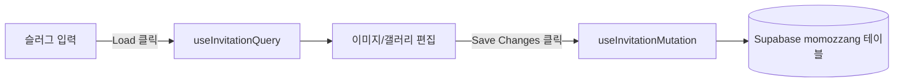

# 관리 어드민 앱 (`momozzang-admin`)

청첩장 데이터를 슬러그로 불러와 이미지/갤러리를 편집하고 저장하는 관리 화면입니다.

- 위치: `apps/momozzang-admin`
- 진입점: `src/main.tsx` → `src/App.tsx`
- dev 서버: `pnpm dev:admin` (`apps/momozzang-admin/vite.config.ts`에서 `server.port: 3002`)
- 빌드: `pnpm build:admin`
- lint: `pnpm --filter momozzang-admin lint`

## 라우트

라우터 정의는 `src/App.tsx`에 있습니다.

| 라우트 | 동작 |
|--------|------|
| `/` | `/admin`으로 리다이렉트(`<Navigate to="/admin" replace />`) |
| `/admin` | `AdminPage` (`src/pages/AdminPage.tsx`) 렌더 |

## 편집 흐름

`AdminPage`(`src/pages/AdminPage.tsx`)가 화면 전체를 담당합니다.



1. **슬러그 입력 → Load** — 입력 필드 기본값은 `demo-captain-luna`. `Load` 버튼(또는 Enter)으로 `slug` 상태를 확정하면 `useInvitationQuery(slug)`가 청첩장 데이터를 조회합니다. 조회 성공 시 로컬 편집 상태(`invitation`)에 반영하고, 실패 시 에러 메시지를 표시합니다.
2. **편집** — 메인 이미지, 공유 썸네일(카카오), 신랑/신부 이미지, 그리고 갤러리 앨범을 수정합니다. 모든 편집은 로컬 상태에만 반영되고, 저장 전까지 서버에 반영되지 않습니다.
3. **저장(Save Changes)** — `useInvitationMutation`으로 `updateInvitation(slug, data)`를 호출해 `momozzang` 테이블의 해당 행 `data` 컬럼을 갱신합니다. 성공/실패 시 `alert`로 결과를 알립니다.

데이터 조회/저장/업로드 훅은 `src/features/invitation/api/`에 있습니다.

- `useInvitationQuery.ts` — 슬러그로 청첩장 조회(react-query).
- `useInvitationMutation.ts` — 청첩장 저장(react-query mutation).
- `useImageUploadMutation.ts` — 이미지 업로드(아래 참조).

## 이미지 업로드 / 리사이즈

- 업로드 전, 클라이언트에서 `canvas`로 이미지를 리사이즈합니다. 최대 크기는 **1920 x 1080**, 가로/세로 비율을 유지하며 긴 변 기준으로 축소하고 품질 `0.8`의 blob으로 인코딩합니다(`AdminPage`의 `handleImageResize`, 갤러리도 동일 로직).
- 리사이즈된 파일을 Supabase Storage `wedding-images` 버킷에 업로드한 뒤 public URL을 사용합니다(`src/features/invitation/api/useImageUploadMutation.ts`).
- 단일 이미지 필드: 메인 이미지(`customization.mainImageUrl`), 공유 썸네일(`invitationInfo.shareImageUrl`), 신랑/신부 이미지(`aboutUs.groomImageUrl` / `aboutUs.brideImageUrl`).

## 갤러리 드래그 정렬

갤러리 관리는 `src/widgets/GalleryManager/GalleryManager.tsx`가 담당하며 `@dnd-kit`(core/sortable/utilities)을 사용합니다.

- 사진을 드래그해 순서를 바꾸면 `arrayMove`로 앨범 배열 순서를 갱신합니다(`onChange`로 상위 상태 반영).
- `PointerSensor`(8px 이동 후 드래그 시작) + `KeyboardSensor`로 마우스/키보드 정렬을 지원하고, `DragOverlay`로 드래그 중 미리보기를 보여줍니다.
- 사진은 최대 **20장**까지 업로드 가능하며, 초과 시 경고를 표시합니다. 개별 사진 삭제(`confirm` 확인 후 배열에서 제거)도 지원합니다.
- 항목 컴포넌트는 `src/widgets/GalleryManager/SortableImage.tsx`입니다.

## 데이터/환경변수

- 데이터 접근은 공유 패키지의 Repository 팩토리(`getInvitationRepository`)를 사용합니다. `VITE_DATA_SOURCE === 'supabase'`일 때 Supabase로 분기합니다. 상세는 [`data-model.md`](./data-model.md), [`shared-ui.md`](./shared-ui.md) 참조.
- admin 전용 환경변수: `VITE_KAKAO_APP_KEY`, `VITE_KAKAO_TEMPLATE_ID`(카카오 공유). 공통 환경변수는 루트 [`CLAUDE.md`](../CLAUDE.md) 참조.

## 관련 명령

```bash
pnpm dev:admin                          # dev 서버 (port 3002)
pnpm build:admin                        # 빌드
pnpm --filter momozzang-admin lint      # lint
```
