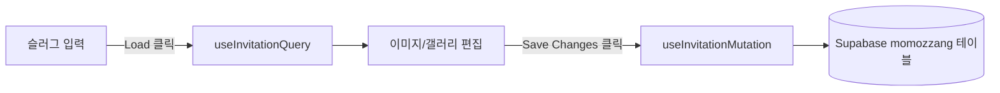

# 관리 어드민 앱 (`momozzang-admin`)

청첩장 데이터를 슬러그로 불러와 이미지/갤러리를 편집하고 저장하는 관리 화면입니다.

- 위치: `apps/momozzang-admin`
- 진입점: `src/main.tsx` → `src/App.tsx`
- dev 서버: `pnpm dev:admin` (`apps/momozzang-admin/vite.config.ts`에서 `server.port: 3002`)
- 빌드: `pnpm build:admin`
- lint: `pnpm --filter momozzang-admin lint`

## 라우트

라우터 정의는 `src/App.tsx`에 있습니다.

| 라우트 | 컴포넌트 | 접근 조건 | 화면 이동 |
|--------|----------|-----------|-----------|
| `/` | `<Navigate to="/admin" replace />` | 공개(리다이렉트만) | — |
| `/login` | `LoginPage` (`src/pages/LoginPage/LoginPage.tsx`) | 공개 | — |
| `/admin` | `ApprovalsPage` (`src/pages/ApprovalsPage/ApprovalsPage.tsx`) | `RequireAdmin` (관리자 로그인) | 공통 상단바(`data-testid="admin-topbar"`)로 `/admin/edit` 과 상호 이동합니다. 목록의 각 행에는 그 슬러그를 실은 `편집` 딥링크가 있습니다 |
| `/admin/edit` | `AdminPage` (`src/pages/AdminPage.tsx`) | `RequireAdmin` (관리자 로그인) | 공통 상단바(`data-testid="admin-topbar"`)로 `/admin` 과 상호 이동합니다. `?slug=` 쿼리를 마운트 시 슬러그 입력·조회의 **초기값으로 수용**하며, 쿼리가 없으면 종전 기본값(`demo-captain-luna`)입니다 |
| `/apply` | `ApplyPage` (`src/pages/ApplyPage/ApplyPage.tsx`) | 공개 | — |
| `/edit` | `EditPage` (`src/pages/EditPage/EditPage.tsx`) | 공개 라우트 + 슬러그+비밀번호 게이트 | — |

`/admin` 은 신청 목록·승인/반려 화면(`ApprovalsPage`)이고, 슬러그를 불러와 이미지·갤러리를 고치는
관리자 편집 화면은 `/admin/edit`(`AdminPage`)로 옮겨졌습니다.

두 보호 화면은 `AdminTopBar`(`src/widgets/AdminTopBar/AdminTopBar.tsx`)를 공유합니다. 상단바는
`신청 관리` / `청첩장 편집` 링크(현재 화면에 `aria-current="page"`), 로그인한 관리자 이메일,
`로그아웃` 버튼을 갖습니다. 상단바는 라우터의 공통 레이아웃이 아니라 **각 보호 페이지의 최상단**에서
렌더합니다 — `RequireAdmin` 바깥으로 올리면 세션 판정 전에 마운트되어 가드 불변식이 깨집니다.

## 신청자 수정 흐름 (`/edit`)

1. **게이트** — 신청할 때 정한 주소(슬러그)와 편집 비밀번호를 입력해 `getInvitationForEdit(slug, editPassword)` 로 잠금을 해제합니다. 슬러그 미존재·비밀번호 불일치·해시 없는 레거시 행 세 경우 모두 `슬러그 또는 비밀번호가 올바르지 않습니다.` 한 문장으로 끝나 존재 여부가 새지 않고, 잠금 전에는 편집 폼을 마운트조차 하지 않습니다.
2. **폼 재사용** — 잠금이 풀리면 `/apply` 와 같은 `useApplyForm`·`ApplyForm`·`ImageStep`·`Stepper`·`PhonePreview` 를 그대로 쓰고, 불러온 청첩장으로 폼 전체를 교체합니다. 저장에 반영되지 않는 `신청 정보`(신청자 연락처·편집 비밀번호) 섹션은 이 화면에서 렌더하지 않습니다.
3. **저장** — 게이트에서 받은 비밀번호를 함께 실어 `updateInvitationWithPassword(slug, editPassword, data)` 로만 저장합니다(무인증 `updateInvitation` 을 쓰지 않습니다). 저장 대상 행은 게이트로 연 슬러그로 고정되며, 공개 상태(`status`)·신청 메타는 그대로 보존됩니다. 데이터 접점은 `src/features/apply/useEditGate.ts` 하나입니다.

## 관리자 편집 흐름 (`/admin/edit`)

`AdminPage`(`src/pages/AdminPage.tsx`)가 화면 전체를 담당합니다.


```mermaid
flowchart LR
    SLUG[슬러그 입력] -->|Load 클릭| Q[useInvitationQuery]
    Q --> EDIT[이미지/갤러리 편집]
    EDIT -->|Save Changes 클릭| M[useInvitationMutation]
    M --> SB[(Supabase momozzang 테이블)]
```

1. **슬러그 입력 → Load** — 입력 필드 기본값은 `demo-captain-luna`. `Load` 버튼(또는 Enter)으로 `slug` 상태를 확정하면 `useInvitationQuery(slug)`가 청첩장 데이터를 조회합니다. 조회 성공 시 로컬 편집 상태(`invitation`)에 반영하고, 실패 시 에러 메시지를 표시합니다.
2. **편집** — 메인 이미지, 공유 썸네일(카카오), 신랑/신부 이미지, 그리고 갤러리 앨범을 수정합니다. 모든 편집은 로컬 상태에만 반영되고, 저장 전까지 서버에 반영되지 않습니다.
3. **저장(Save Changes)** — `useInvitationMutation`으로 `updateInvitation(slug, data)`를 호출해 `momozzang` 테이블의 해당 행 `data` 컬럼을 갱신합니다. 성공/실패 시 `alert`로 결과를 알립니다.

데이터 조회/저장/업로드 훅은 `src/features/invitation/api/`에 있습니다.

- `useInvitationQuery.ts` — 슬러그로 청첩장 조회(react-query).
- `useInvitationMutation.ts` — 청첩장 저장(react-query mutation).
- `useImageUploadMutation.ts` — 이미지 업로드(아래 참조).

## 이미지 업로드 / 리사이즈

- 업로드 전, 클라이언트에서 `canvas`로 이미지를 리사이즈합니다. 최대 크기는 **1920 x 1080**, 가로/세로 비율을 유지하며 긴 변 기준으로 축소하고 품질 `0.8`의 blob으로 인코딩합니다(`AdminPage`의 `handleImageResize`, 갤러리도 동일 로직).
- 리사이즈된 파일을 Supabase Storage `wedding-images` 버킷에 업로드한 뒤 public URL을 사용합니다(`src/features/invitation/api/useImageUploadMutation.ts`).
- 단일 이미지 필드: 메인 이미지(`customization.mainImageUrl`), 공유 썸네일(`invitationInfo.shareImageUrl`), 신랑/신부 이미지(`aboutUs.groomImageUrl` / `aboutUs.brideImageUrl`).

## 갤러리 드래그 정렬

갤러리 관리는 `src/widgets/GalleryManager/GalleryManager.tsx`가 담당하며 `@dnd-kit`(core/sortable/utilities)을 사용합니다.

- 사진을 드래그해 순서를 바꾸면 `arrayMove`로 앨범 배열 순서를 갱신합니다(`onChange`로 상위 상태 반영).
- `PointerSensor`(8px 이동 후 드래그 시작) + `KeyboardSensor`로 마우스/키보드 정렬을 지원하고, `DragOverlay`로 드래그 중 미리보기를 보여줍니다.
- 사진은 최대 **20장**까지 업로드 가능하며, 초과 시 경고를 표시합니다. 개별 사진 삭제(`confirm` 확인 후 배열에서 제거)도 지원합니다.
- 항목 컴포넌트는 `src/widgets/GalleryManager/SortableImage.tsx`입니다.

## 데이터/환경변수

- 데이터 접근은 공유 패키지의 Repository 팩토리(`getInvitationRepository`)를 사용합니다. `VITE_DATA_SOURCE === 'supabase'`일 때 Supabase로 분기합니다. 상세는 [`data-model.md`](./data-model.md), [`shared-ui.md`](./shared-ui.md) 참조.
- admin 전용 환경변수: `VITE_KAKAO_APP_KEY`, `VITE_KAKAO_TEMPLATE_ID`(카카오 공유). 공통 환경변수는 루트 [`CLAUDE.md`](../CLAUDE.md) 참조.

## 관련 명령

```bash
pnpm dev:admin                          # dev 서버 (port 3002)
pnpm build:admin                        # 빌드
pnpm --filter momozzang-admin lint      # lint
```
