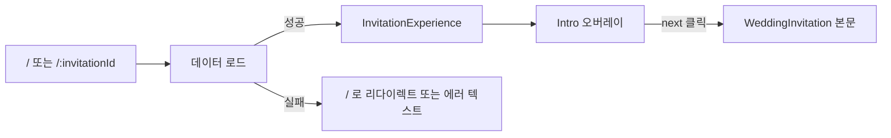

# 청첩장 뷰어 앱 (`momozzang-invitation`)

하객이 보는 공개 청첩장 화면입니다. 슬러그(URL)로 청첩장 데이터를 조회해 인트로 오버레이 → 본문(섹션 스크롤) 흐름으로 보여줍니다.

- 위치: `apps/momozzang-invitation`
- 진입점: `src/main.tsx` → `src/page/AppWrapper.tsx`
- dev 서버: `pnpm dev:invitation`
- 빌드: `pnpm build:invitation`
- lint: `pnpm --filter momozzang-invitation lint`

## 라우트

라우터 정의는 `src/page/AppWrapper.tsx`에 있습니다.

| 라우트 | 컴포넌트 | 동작 |
|--------|----------|------|
| `/` | `Invitation` (`src/page/Invitation.tsx`) | 기본 화면. 현재 하드코딩 슬러그 `demo-captain-luna`를 `useInvitation` 훅으로 로드합니다(코드에 TODO 주석 존재). 로딩 중 `Loading...`, 실패 시 `Error loading invitation` 텍스트를 노출합니다. |
| `/:invitationId` | `InvitationById` (`src/page/InvitationById.tsx`) | URL 슬러그(`invitationId`)를 react-query로 조회합니다. 로딩 중 전체화면 `Loading...`, 조회 실패/데이터 없음이면 `/`로 리다이렉트(`<Navigate to="/" replace />`). |
| `*` | — | 정의되지 않은 모든 경로를 `/`로 리다이렉트. |

> 주의: `/` 라우트의 `Invitation`은 데이터 레이어를 `useInvitation('demo-captain-luna')` 훅으로 직접 호출하고, `/:invitationId`의 `InvitationById`는 `getInvitationRepository()` + `useQuery`로 호출합니다. 두 경로의 로딩/에러 처리 방식이 서로 다릅니다.

## 화면 흐름



1. **데이터 로드** — 라우트가 슬러그로 청첩장(`WeddingInvitation`)을 조회합니다.
2. **InvitationExperience** (`src/page/InvitationExperience.tsx`) — 로드된 `metadata`를 `InvitationProvider`로 감싸 컨텍스트에 주입합니다.
3. **인트로 오버레이** — `Intro` 위젯(`@momozzang/ui` widgets)을 먼저 띄웁니다. `next` 콜백이 호출되면 인트로가 사라지고 본문이 보입니다(`showIntro` 상태로 토글). 인트로가 떠 있는 동안 본문은 `inert` + `aria-hidden`으로 비활성화됩니다.
4. **본문 (Suspense lazy 로드)** — 본문 페이지 `WeddingInvitation`은 `React.lazy`로 `@momozzang/ui/pages/WeddingInvitation`을 동적 import 하며 `Suspense`로 감쌉니다. `usePreloadWeddingChunk`가 마운트 시 본문 청크를 미리 불러옵니다.

## 본문 섹션 구성

본문 페이지는 `packages/ui/src/pages/WeddingInvitation/WeddingInvitation.tsx`에서 조립됩니다. 스크롤 위치에 따라 현재 메뉴를 추적(`useCurrentMenuByScroll`)하고, 메뉴 클릭 시 해당 섹션으로 스무스 스크롤합니다.

| 섹션 | 위젯 | 비고 |
|------|------|------|
| Home | `@widgets/invitation/Home` | 메인/대표 영역 |
| MiniRoom | `@widgets/invitation/MiniRoom` | 싸이월드 감성 미니룸 + 방명록(`GuestBook`) |
| Gallery | `@widgets/invitation/Gallery` | 앨범 사진 갤러리 |
| Direction | `@widgets/invitation/Direction` | 오시는 길/지도 (네이버 지도, `VITE_NAVER_MAP_CLIENT_ID` 사용) |
| Account | `@widgets/invitation/Account` | 마음 전하실 곳(계좌) |

그 외 `@momozzang/ui`의 invitation 위젯으로 `Header`, `Music`, `IntroOverlay` 등이 있습니다(`packages/ui/src/widgets/invitation/`). 헤더는 현재 메뉴 하이라이트와 메뉴 클릭 스크롤을 담당합니다.

## 데이터/환경변수

- 청첩장 데이터는 Repository 팩토리(`getInvitationRepository`)를 통해 조회합니다. `VITE_DATA_SOURCE === 'supabase'`면 Supabase, 아니면 로컬 구현으로 분기합니다. 자세한 내용은 [`data-model.md`](./data-model.md), [`shared-ui.md`](./shared-ui.md) 참조.
- 방명록은 `getGuestBookRepository`로 접근합니다.
- 지도 섹션은 `VITE_NAVER_MAP_CLIENT_ID` 환경변수를 사용합니다.
- 로컬 개발 시 `/api` 요청은 `apps/momozzang-invitation/vite.config.ts`에서 `http://localhost:8081`로 프록시됩니다.

## 관련 명령

```bash
pnpm dev:invitation                          # dev 서버
pnpm build:invitation                        # 빌드
pnpm --filter momozzang-invitation lint      # lint
pnpm --filter momozzang-invitation migrate   # 데이터 마이그레이션 스크립트
```
