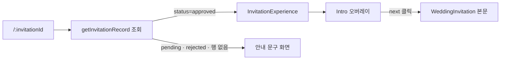

# 청첩장 뷰어 앱 (`momozzang-invitation`)

하객이 보는 공개 청첩장 화면입니다. 슬러그(URL)로 청첩장 데이터를 조회해 인트로 오버레이 → 본문(섹션 스크롤) 흐름으로 보여줍니다.

- 위치: `apps/momozzang-invitation`
- 진입점: `src/main.tsx` → `src/page/AppWrapper.tsx`
- dev 서버: `pnpm dev:invitation`
- 빌드: `pnpm build:invitation`
- lint: `pnpm --filter momozzang-invitation lint`

## 라우트

라우터 정의는 `src/page/AppWrapper.tsx`에 있습니다.

| 라우트 | 컴포넌트 | 동작 |
|--------|----------|------|
| `/` | `OnboardingPage` (`src/page/OnboardingPage.tsx`) | 서비스 소개 랜딩. 신청 → 승인 → 공개 3단계를 안내하고 `청첩장 신청하기` CTA 앵커를 보여줍니다. CTA 의 `href` 는 환경변수 `VITE_APPLY_URL` 값이며, 값이 비어 있으면 앵커를 렌더하지 않고 `신청 주소가 아직 설정되지 않았습니다. 운영자에게 문의해 주세요.` 만 표시합니다(죽은 링크를 만들지 않습니다). 청첩장 본문 데이터는 쓰지 않습니다. |
| `/:invitationId` | `InvitationById` (`src/page/InvitationById.tsx`) | URL 슬러그(`invitationId`)로 `getInvitationRecord` 를 react-query 로 조회하고 공개 상태(`status`)에 따라 분기합니다(아래 표). |
| `*` | — | 정의되지 않은 모든 경로를 `/`로 리다이렉트. |

### `/:invitationId` 의 status 게이트

조회는 본문만 주는 `getInvitation` 이 아니라 `getInvitationRecord` 로 합니다 — 공개 여부를 볼 수 없으면 게이트가 성립하지 않습니다. 판정은 아래 순서의 early return 이며, 승인되지 않은 화면에서는 `InvitationExperience` 를 **아예 렌더하지 않습니다**(본문을 그린 뒤 안내 배너만 얹으면 인트로 뒤에 실명·예식장 주소가 DOM 에 남아 비공개가 아닙니다).

| 조건 | 화면 문구 | 앵커 |
|------|-----------|------|
| 조회 중 | `불러오는 중입니다.` | `data-testid="invitation-loading"` |
| 조회 실패 | `청첩장을 불러오지 못했습니다.` | `data-testid="invitation-error"` |
| 저장된 행 없음 | `존재하지 않는 청첩장입니다.` (보조: `주소를 다시 확인해 주세요.`) | `data-testid="invitation-notice-missing"` |
| `status='pending'` | `승인 대기 중인 청첩장입니다.` (보조: `승인이 완료되면 청첩장이 공개됩니다.`) | `data-testid="invitation-notice-pending"` |
| `status='rejected'` | `공개되지 않은 청첩장입니다.` (보조: `자세한 내용은 신청 시 입력하신 연락처로 안내드립니다.`) | `data-testid="invitation-notice-rejected"` |
| `status='approved'` | 안내 문구 없이 `InvitationExperience` 본문 렌더 | — |

저장된 행이 없을 때는 예외가 아니라 정상 경로이며 `/` 로 리다이렉트하지 않습니다.

위 표는 **화면 문구·앵커의 정본**이라 행을 고치지 않습니다. 각 조건에서 사용자가 할 수 있는 행동은
아래 **액션 열**로 덧붙입니다 — 안내 화면은 막다른 골목이 아니어야 합니다.

| 조건 | 액션 |
|------|------|
| 조회 중 | 진행 표시(`data-testid="invitation-loading-progress"`, `aria-hidden="true"`). `prefers-reduced-motion: reduce` 에서는 애니메이션을 끄고 정적 막대로 대체합니다 |
| 조회 실패 | `다시 시도` 버튼(`data-testid="invitation-error-retry"`) → `refetch()`. 재조회 중 라벨은 `다시 시도 중...` |
| 저장된 행 없음 | `모모짱 홈으로` 링크(`data-testid="invitation-missing-home"`, `href="/"`) |
| `status='pending'` | `상태 다시 확인` 버튼(`data-testid="invitation-pending-refresh"`) → `refetch()`, 재조회 중 라벨은 `확인 중...`. 함께 놓인 안내 문장(`data-testid="invitation-pending-help"`)이 승인 절차와 결과 통보 경로를 알립니다 |
| `status='rejected'` | `모모짱 홈으로` 링크(`data-testid="invitation-rejected-home"`, `href="/"`) |
| `status='approved'` | — (본문이 열립니다) |

조회는 `retry: false` 라 실패해도 자동 재시도가 없습니다. 그래서 실패·대기 화면의 재조회는 **사용자가
직접 눌러야** 하고, 위 두 버튼이 그 유일한 경로입니다(새로고침을 요구하지 않습니다).

## 화면 흐름


```mermaid
flowchart LR
    R["/:invitationId"] --> L[getInvitationRecord 조회]
    L -->|"status=approved"| EXP[InvitationExperience]
    L -->|"pending · rejected · 행 없음"| NOTICE[안내 문구 화면]
    EXP --> INTRO[Intro 오버레이]
    INTRO -->|next 클릭| BODY[WeddingInvitation 본문]
```

1. **데이터 로드** — `/:invitationId` 가 슬러그로 청첩장 레코드(`InvitationRecord`)를 조회하고, `status='approved'` 일 때만 아래 흐름으로 넘어갑니다.
2. **InvitationExperience** (`src/page/InvitationExperience.tsx`) — 로드된 `metadata`를 `InvitationProvider`로 감싸 컨텍스트에 주입합니다.
3. **인트로 오버레이** — `Intro` 위젯(`@momozzang/ui` widgets)을 먼저 띄웁니다. `next` 콜백이 호출되면 인트로가 사라지고 본문이 보입니다(`showIntro` 상태로 토글). 인트로가 떠 있는 동안 본문은 `inert` + `aria-hidden`으로 비활성화됩니다.
4. **본문 (Suspense lazy 로드)** — 본문 페이지 `WeddingInvitation`은 `React.lazy`로 `@momozzang/ui/pages/WeddingInvitation`을 동적 import 하며 `Suspense`로 감쌉니다. `usePreloadWeddingChunk`가 마운트 시 본문 청크를 미리 불러옵니다.

## 본문 섹션 구성

본문 페이지는 `packages/ui/src/pages/WeddingInvitation/WeddingInvitation.tsx`에서 조립됩니다. 스크롤 위치에 따라 현재 메뉴를 추적(`useCurrentMenuByScroll`)하고, 메뉴 클릭 시 해당 섹션으로 스무스 스크롤합니다.

| 섹션 | 위젯 | 비고 |
|------|------|------|
| Home | `@widgets/invitation/Home` | 메인/대표 영역 |
| MiniRoom | `@widgets/invitation/MiniRoom` | 싸이월드 감성 미니룸 + 방명록(`GuestBook`) |
| Gallery | `@widgets/invitation/Gallery` | 앨범 사진 갤러리 |
| Direction | `@widgets/invitation/Direction` | 오시는 길/지도 (네이버 지도, `VITE_NAVER_MAP_CLIENT_ID` 사용) |
| Account | `@widgets/invitation/Account` | 마음 전하실 곳(계좌) |

그 외 `@momozzang/ui`의 invitation 위젯으로 `Header`, `Music`, `IntroOverlay` 등이 있습니다(`packages/ui/src/widgets/invitation/`). 헤더는 현재 메뉴 하이라이트와 메뉴 클릭 스크롤을 담당합니다.

## 데이터/환경변수

- 청첩장 데이터는 Repository 팩토리(`getInvitationRepository`)를 통해 조회합니다. `VITE_DATA_SOURCE === 'supabase'`면 Supabase, 아니면 로컬 구현으로 분기합니다. 자세한 내용은 [`data-model.md`](./data-model.md), [`shared-ui.md`](./shared-ui.md) 참조.
- 방명록은 `getGuestBookRepository`로 접근합니다.
- 지도 섹션은 `VITE_NAVER_MAP_CLIENT_ID` 환경변수를 사용합니다.
- 로컬 개발 시 `/api` 요청은 `apps/momozzang-invitation/vite.config.ts`에서 `http://localhost:8081`로 프록시됩니다.
- 랜딩(`/`)의 `내 청첩장 수정하기` 앵커는 `VITE_EDIT_URL` 을 가리킵니다(어드민 앱의 `/edit` 주소). 값이 비어 있으면 앵커를 렌더하지 않고 안내 문구만 냅니다 — `VITE_APPLY_URL` 과 같은 규칙입니다.
- 랜딩의 **상태 확인** 입력에 청첩장 주소(슬러그)를 넣고 제출하면 `/<슬러그>` 로 이동합니다. 앞뒤 공백은 제거하며, 값이 공백뿐이면 이동하지 않고 `청첩장 주소를 입력해 주세요.` 를 `role="alert"` 로 알립니다.

## 관련 명령

```bash
pnpm dev:invitation                          # dev 서버
pnpm build:invitation                        # 빌드
pnpm --filter momozzang-invitation lint      # lint
pnpm --filter momozzang-invitation migrate   # 데이터 마이그레이션 스크립트
```
