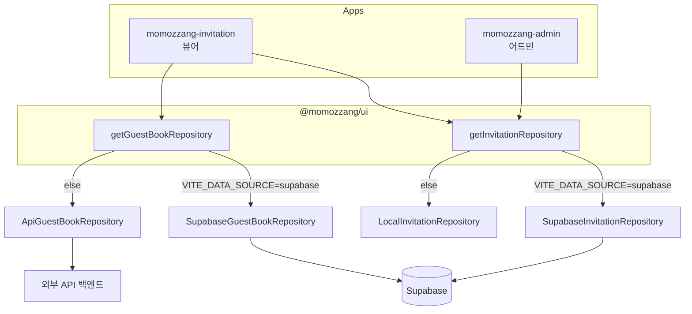

# 시스템 개요

momozzang는 픽셀/싸이월드 감성의 **모바일 청첩장** 서비스입니다. 하나의 pnpm 모노레포 안에 하객용 뷰어 앱, 관리용 어드민 앱, 그리고 둘이 공유하는 패키지가 들어 있습니다.

이 문서는 영역별 상세 문서의 진입점입니다.

- [`invitation-app.md`](./invitation-app.md) — 하객용 청첩장 뷰어 앱
- [`admin-app.md`](./admin-app.md) — 청첩장 관리 어드민 앱
- [`data-model.md`](./data-model.md) — `WeddingInvitation`/`GuestBook` 엔티티와 Supabase 테이블 매핑
- [`shared-ui.md`](./shared-ui.md) — `@momozzang/ui` 패키지 구조와 Repository 데이터 레이어

## 구성 요소

| 구성 요소 | 위치 | 역할 |
|-----------|------|------|
| 청첩장 뷰어 | `apps/momozzang-invitation` | 슬러그로 청첩장을 조회해 하객에게 보여주는 공개 화면 |
| 관리 어드민 | `apps/momozzang-admin` | 슬러그로 데이터를 불러와 이미지/갤러리를 편집·저장 |
| 공유 패키지 | `packages/ui` (`@momozzang/ui`) | UI 컴포넌트, 도메인 엔티티, Repository 데이터 레이어 |

두 앱 모두 React 19 + Vite 7 + TypeScript로 작성되며, 라우팅은 react-router-dom 7, 서버 상태는 @tanstack/react-query 5로 다룹니다. 데이터 저장소는 Supabase(`@supabase/supabase-js`)와 외부 API 백엔드를 함께 사용합니다.

## 데이터 흐름

청첩장 데이터와 방명록 데이터는 모두 **Repository 패턴 + 팩토리**를 통해 접근합니다. 팩토리는 환경변수 `VITE_DATA_SOURCE`로 구현체를 분기합니다.



- **청첩장 조회**: `getInvitationRepository().getInvitation(slug)` → `momozzang` 테이블(`slug` 컬럼)에서 JSON `data` 컬럼을 읽어 `WeddingInvitation` 객체로 반환.
- **청첩장 저장(어드민)**: `updateInvitation(slug, data)` → 같은 행의 `data` 컬럼을 갱신.
- **방명록**: `guestbooks` 테이블에서 `wedding_invitation_id`로 조회/작성/삭제.
- **이미지 업로드(어드민)**: Supabase Storage `wedding-images` 버킷에 업로드 후 public URL 사용.
- **배포 프록시**: 운영 환경에서는 `vercel.json`의 rewrite로 `/api/*` 요청이 외부 백엔드(`momozzang.onrender.com`)로 전달됩니다.

자세한 분기 동작과 테이블 스키마는 [`data-model.md`](./data-model.md)와 [`shared-ui.md`](./shared-ui.md)를 참조하세요.

## 실행/빌드 명령

루트에서 실행합니다. 전체 목록은 루트 [`CLAUDE.md`](../CLAUDE.md)를 참조하세요.

```bash
pnpm install
pnpm dev:invitation   # 뷰어 dev 서버
pnpm dev:admin        # 어드민 dev 서버 (port 3002)
pnpm build            # 전체 빌드 (pnpm -r build)
```
